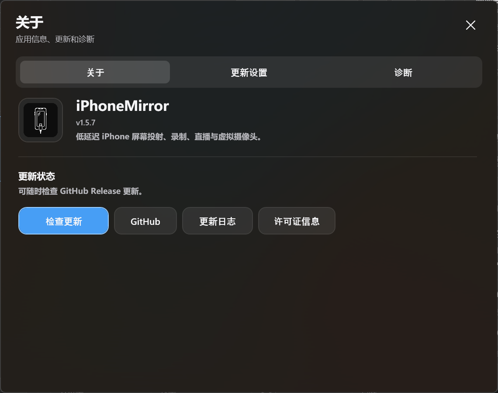
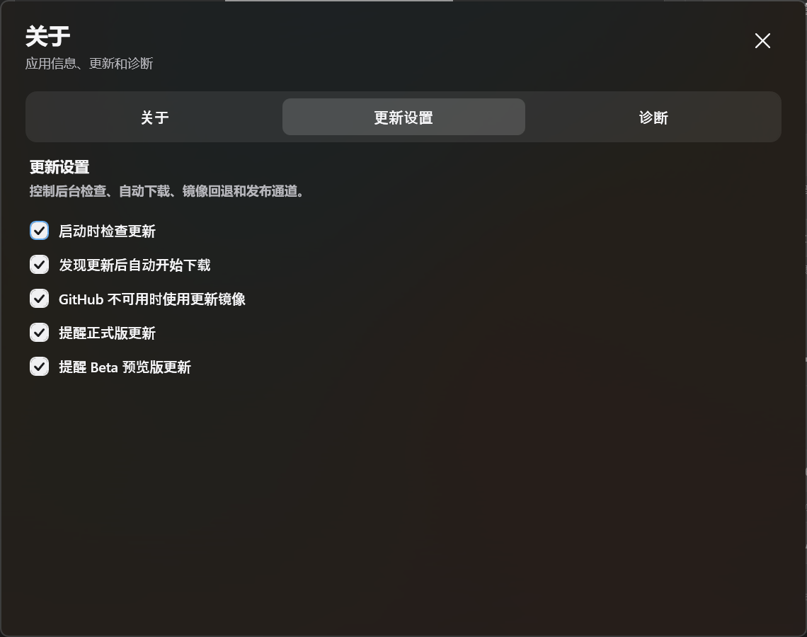
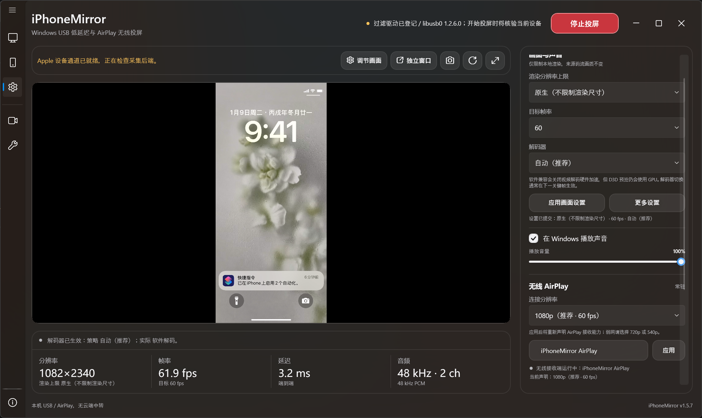
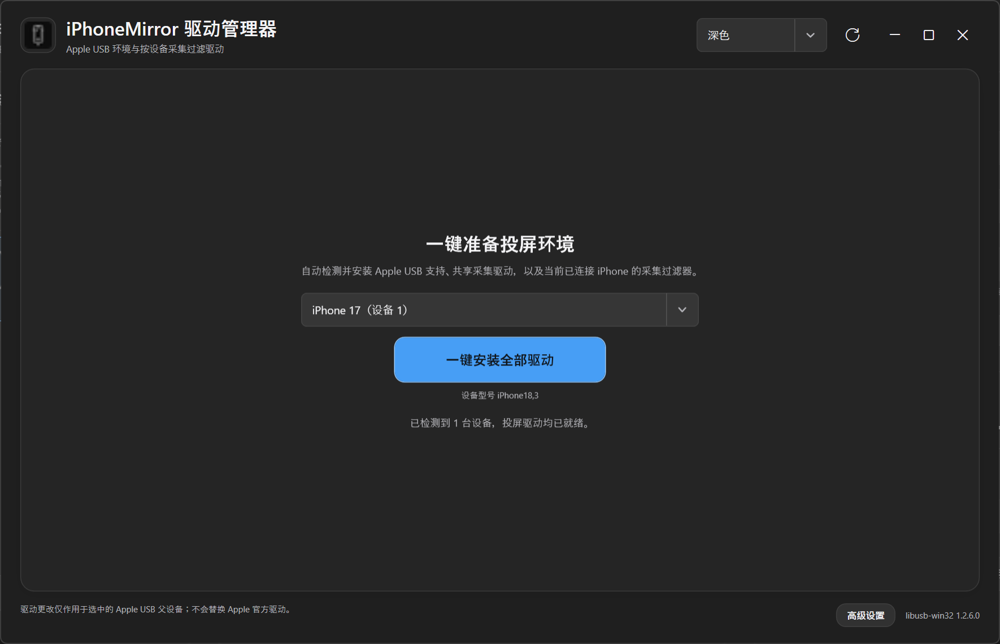
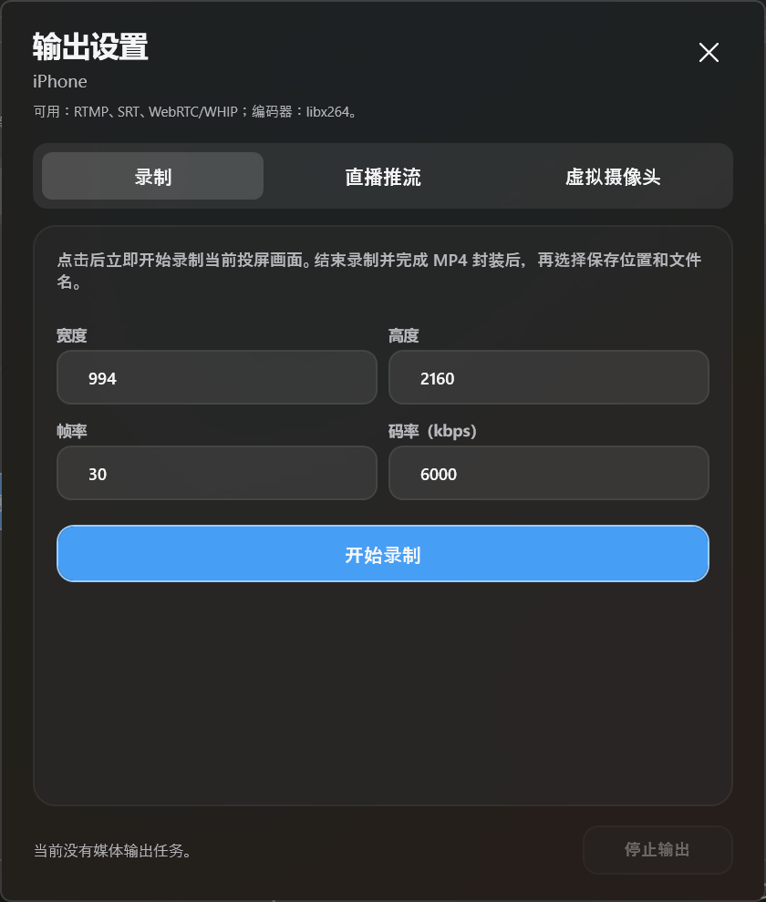
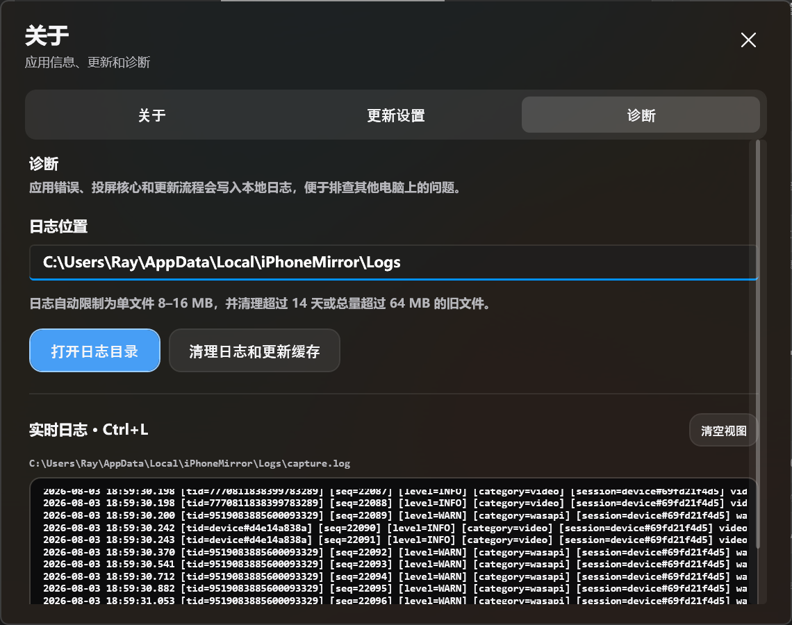

# iPhoneMirror 完整使用教程

本文按 iPhoneMirror v1.8.3（2026-09-06）更新，覆盖驱动安装、USB 有线投屏、AirPlay 无线屏幕镜像、
AirPlay 音乐投放、视频应用投屏、多设备、独立窗口、音频、截图、录制与推流、虚拟摄像头、
实时日志和高级 USB 设置。

本文截图均使用无损 PNG 保存，保留捕获时的原始像素尺寸，并且不在 Markdown 中设置缩放尺寸。

> [!IMPORTANT]
> iPhoneMirror 使用 Apple 私有 Screen Capture 协议和兼容 AirPlay 接收实现。
> iOS 更新后可能需要适配。程序当前未进行商业 Authenticode 签名，Windows 可能显示
> SmartScreen 或“未知发布者”提示。

> [!NOTE]
> 官方版本仅支持 Windows 10/11 x64，不支持 Windows ARM64。完整 USB 链路依赖只有 x64
> 二进制的 `libusb-win32` 内核驱动，无线接收运行库目前也只有 x64 版本；Windows 11 ARM64
> 的 x64 应用仿真不能加载 x64 内核驱动，因此不把仿真运行视为受支持配置。

## 目录

- [软件亮点](#软件亮点)
- [与常见投屏方案的区别](#与常见投屏方案的区别)
- [蓝牙反向控制](#蓝牙反向控制)
- [安装、更新与卸载](#安装更新与卸载)
- [主界面](#主界面)
- [安装和管理有线驱动](#安装和管理有线驱动)
- [USB 有线投屏](#usb-有线投屏)
- [AirPlay 无线投屏](#airplay-无线投屏)
- [有线与无线反向控制](#有线与无线反向控制)
- [AirPlay 音乐投放](#airplay-音乐投放)
- [视频应用投屏](#视频应用投屏)
- [多设备与设备排序](#多设备与设备排序)
- [画面、声音和预览工具](#画面声音和预览工具)
- [独立窗口与全屏](#独立窗口与全屏)
- [输出、直播与录制](#输出直播与录制)
- [截图与实时日志](#截图与实时日志)
- [高级 USB 设置](#高级-usb-设置)
- [语言与快捷键](#语言与快捷键)
- [常见问题](#常见问题)

## 软件亮点

### 1. 按真实 iPhone/iPad 外形单独适配

iPhoneMirror 不把所有设备都套进同一个通用圆角矩形。程序会读取设备的 Apple
`ProductType`，识别具体机型族，并为独立窗口应用对应的屏幕曲线：

- iPhone X；
- 刘海屏 iPhone；
- iPhone 12 mini、13 mini；
- 标准尺寸和 Max 尺寸 iPhone；
- Dynamic Island 机型；
- iPad Pro、iPad Air、iPad mini 和全面屏基础款 iPad；
- 带 Home 键或已知直角屏幕设备保持直角，不强行裁切。

圆角不仅是窗口装饰。核心渲染器会按设备配置裁切画面边缘，独立窗口的可视轮廓、
拖动缩放和全屏切换也使用同一套形状数据。未知新机型会保守地根据画面比例回退，
避免用手机曲线误裁 iPad。这是 iPhoneMirror 很容易被忽略、但长期使用时非常明显的细节。

圆角参数是根据公开设备外观和真实画面比例进行的视觉拟合；Apple 并未公开每款屏幕的
数值圆角半径，因此这里描述的是机型级视觉适配，不是 Apple 官方工业尺寸数据。

### 2. USB 与 AirPlay 使用同一套工作流

USB 适合低延迟、高稳定性和高画质；AirPlay 适合免插线和临时连接。两种来源进入同一套
设备列表、预览、声音、截图、独立窗口和 OBS 流程，不需要在两个软件之间切换。

### 3. 真正面向多设备

每台设备拥有独立会话和独立预览窗口。用户可以保持一台设备运行，再从设备列表为另一台
设备打开同时投屏；设备卡片支持长按拖动排序。多个无线发送端也可以同时连接，程序没有设置
固定的 UI 数量上限，实际数量由电脑的 CPU/GPU、内存和局域网带宽决定。

### 4. 本地原生低延迟渲染

USB H.264/CoreMedia 和无线屏幕镜像帧在本地解码，通过 D3D11/DirectComposition 原生显示，
不经过云端中转。主预览、独立窗口和全屏使用原生渲染目标，减少 WPF 位图复制、缩放损失和撕裂。

### 5. 驱动操作与投屏进程隔离

主程序只检查驱动状态，不在投屏进程内修改系统驱动。安装、修复和卸载由独立的
`iPhoneMirror.Driver.exe` 完成；默认界面只保留“一键安装全部驱动”，高级页面再提供诊断、
修复、卸载和日志，降低普通用户误操作 Apple 父驱动的风险。

### 6. 为 OBS 准备的干净窗口

独立预览窗口只显示手机画面，没有按钮、设备列表和状态面板，可以直接用于 OBS
“窗口采集”。应用截图直接读取最新解码帧写入 PNG，不会把主界面、鼠标或窗口边框截进去。

## 与常见投屏方案的区别

| 对比维度 | iPhoneMirror | 常见通用方案 |
|---|---|---|
| 连接方式 | USB 私有采集与局域网 AirPlay 同时提供 | 只支持 AirPlay，或 USB 与无线分成不同程序 |
| 数据路径 | 本机解码与渲染，无云端中转 | 部分方案依赖账号、云服务或远端中继 |
| 设备外形 | 按具体 iPhone/iPad 机型族匹配圆角和曲线 | 所有设备使用统一圆角、黑边或矩形窗口 |
| 多设备 | 每台设备独立会话、独立窗口、可排序 | 常见产品围绕单设备设计，切换时停止上一台 |
| 有线协议选择 | A 演示、B AirPlay 实验、C 爱思兼容按设备保存 | 通常只有固定模式，无法明确选择兼容策略 |
| OBS | 干净的原生独立窗口，可窗口采集 | 常见做法需要裁掉软件 UI 或捕获整个桌面 |
| 驱动 | 独立管理器，一键判断缺失项并支持修复/卸载 | 驱动逻辑隐藏在主程序内，失败时信息较少 |
| 诊断 | 主程序实时日志、驱动独立日志和明确错误路径 | 常见产品只显示“连接失败”或通用错误码 |
| 隐私 | USB 与 AirPlay 媒体都留在本机/局域网 | 取决于具体产品，可能要求登录或联网服务 |

这些差异不代表 iPhoneMirror 在所有场景都更合适。它没有内建录屏编辑器，也不能保证
Apple 私有协议在所有未来 iOS 版本上永久兼容。

## 蓝牙反向控制

iPhoneMirror 的控制链路与投屏链路分开：电脑蓝牙会以标准 BLE HID 鼠标/键盘外设身份
广播，iPhone/iPad 通过系统“辅助触控”接收鼠标指针和键盘报告。手机端不需要安装 App，
也不需要越狱。控制输入只作用于当前绑定的镜像设备，不会广播给其他已连接手机。

使用前请确认：

1. Windows 10 1809 或更高版本，并且蓝牙适配器支持 **Peripheral role（外设模式）**。
   很多台式机蓝牙适配器只支持中心模式，软件会显示明确的能力错误，此时只能投屏。
2. 在 iPhone/iPad 打开“设置 → 辅助功能 → 触控 → 辅助触控”，开启辅助触控，并在
   “设备”中配对电脑显示的 HID 设备。
3. 选择设备后打开左侧“投屏”面板，点击“启用蓝牙反向控制”。可以在开始投屏前完成蓝牙
   广播和配对；首次连接时，在蓝牙客户端绑定窗口中确认与当前手机对应的客户端。绑定完成后，
   主预览中的鼠标移动、单击、拖拽、滚轮和常用键盘按键会发送到该设备。
4. 反向控制开启后会隐藏 Windows 本机光标；默认按 `F9` 可释放鼠标并关闭蓝牙控制，也可以在
   “设置快捷键”窗口中改为其他全局快捷键。该窗口还可配置有线投屏、无线投屏、蓝牙控制、
   控制中心、通知中心、App 切换器、主屏幕、Boss 键、音量、锁屏、Dock 和 Siri。F12 保留为
   不可设置的系统键；F1-F11、右键和中键可以直接录入。滚轮方向和鼠标灵敏度可按竖屏/横屏
   分别设置，打开独立预览窗口时，主窗口反向控制会自动关闭。

控制能力受 iOS 系统鼠标模型限制：主要是单指指针操作，不能注入真正的多指触控或游戏
触摸事件。停止投屏时控制广播会自动关闭；也可以在同一面板手动关闭。客户端断开后不会
自动转移到另一台手机，原客户端重新连接后才会恢复；可在设置中解除单个绑定或清除全部绑定。

## 安装、更新与卸载

### 标准安装

1. 从 [GitHub Releases](https://github.com/RayrenSX/iPhoneMirror/releases) 下载最新的
   `iPhoneMirror-Setup-v*-x64.exe`。
2. 可使用同一 Release 的 `SHA256SUMS.txt` 校验文件完整性。
3. 双击运行安装向导。管理员安装默认目录为 `C:\Program Files\iPhoneMirror`，也可自定义；
   按当前用户安装时会使用 Windows 用户级程序目录；
   开始菜单快捷方式会自动创建，桌面快捷方式可以选择是否创建。
4. Windows 显示 SmartScreen 时，确认文件来自项目官方 Release，再选择“更多信息”并继续。
5. 安装完成后从开始菜单启动。界面语言默认“跟随系统”，可在左侧“设置”中的“应用设置”切换为
   简体中文、繁体中文（香港）或 English。

需要免安装时可以下载 `iPhoneMirror-v*-win-x64.zip`，完整解压到普通文件夹后运行
`iPhoneMirror.exe`，不要直接在压缩包内运行。两种包都自带 .NET 运行时；不要单独移动
主程序、核心 DLL、`Wireless` 文件夹或驱动管理器。

若 ZIP 版在其他电脑上启动无线组件时显示 `avutil-56.dll`“损坏的映像”，错误状态
`0xc0e90002`，这表示 Windows 代码完整性策略阻止了从 Internet 下载的未签名 DLL，
并不表示发布文件的 SHA256 已损坏。优先改用 Setup 安装版；必须使用 ZIP 时，请删除
已解压目录，在下载的 ZIP 文件“属性”中勾选“解除锁定”，然后重新完整解压。新版会在
启动无线接收器前执行无弹窗预检，并在应用内显示这条处理建议。

### 自动更新

程序默认在每次启动后检查 GitHub Release，检查失败不会阻止投屏。发现新版本后，更新窗口会
显示当前/最新版本、发布日期和 Markdown 更新说明。点击“立即更新”会下载 Setup（没有 Setup
时回退到 ZIP），并显示百分比、速度和分段连接数。服务器支持 Range 时最多并行使用 8 个分段；
不支持时自动回退为单连接。

下载内容必须先从官方 GitHub API 或 `raw.githubusercontent.com` 获得发布元数据与 SHA-256，
校验通过后才会启动安装。可在“关于 → 更新设置”启用最快线路自动选择：程序先对 GitHub 和
应用更新下载可对 GitHub 和 MoreTools 镜像执行测速，再从每条可达线路下载 256 KB 样本，
按实测吞吐量从快到慢尝试。正式下载连续 30 秒没有进度，或发生网络、大小、重定向和摘要校验
错误时，会自动切换到下一条已测速线路。镜像只传输应用更新文件字节，不能替代官方摘要或放宽校验。
DDI 不使用镜像测速逻辑，首次挂载时始终从 GitHub 官方 API 解析并下载匹配文件，完成 Git blob、
大小、SHA-256 和运行时版本校验；需要离线时才使用 `--ddi-dir` 指定的官方本地 DDI。
随后程序关闭旧版本、覆盖升级并自动重新启动。下载失败或中断后可以直接重试，残留临时文件会在
下次启动时清理。应用更新时仍会显示必要的 UAC 管理员确认，但不会显示 PowerShell 控制台窗口。

左侧“关于”可手动检查更新，并包含“更新设置”和“诊断”选项卡。启动检查、自动下载、资源镜像、
正式版提醒和 Beta 版提醒都在“更新设置”中；跟随系统、深色和浅色主题只在主界面的
“设置 → 应用设置”中提供，关于窗口不再重复显示主题选项。





### 卸载

可从 Windows“设置 → 应用 → 已安装的应用”，或开始菜单的“卸载”入口移除程序。卸载器会
删除程序文件、快捷方式和注册信息，并询问是否同时删除 `%LOCALAPPDATA%\iPhoneMirror` 中的
设置和已下载更新；选择“否”会保留这些用户数据，供以后重新安装继续使用。

## 主界面

主界面使用左侧导航栏组织工作区：

1. **投屏**：回到主预览和当前来源的操作区。
2. **投屏来源**：打开来源侧栏，查看设备名称、型号、iOS 版本、连接类型和状态，并刷新、选择或排序来源。
3. **设置**：打开投屏设置侧栏，管理无线接收端、有线协议、画面、声音、预览工具和应用偏好。
4. **输出**：打开录制、直播推流和虚拟摄像头设置窗口。
5. **驱动**：打开独立的有线驱动管理器。
6. **关于**：查看版本、检查更新、设置更新通道并打开诊断工具。

顶部显示驱动/采集状态和一个随状态变化的“开始投屏”或“停止投屏”按钮，没有单独的暂停按钮。
中央区域显示当前来源画面；底部状态栏显示分辨率、帧率、延迟和音频状态。来源侧栏与设置侧栏
可以同时保持打开；设备专属设置只作用于当前选中的来源，不会覆盖其他设备的协议、画质或音频偏好。



当 Windows 显示缩放高于 100% 或窗口跨越不同 DPI 的显示器时，主程序和驱动管理器会自动限制在
当前显示器工作区内；过大的窗口最多占可用区域的 80%，避免边框和桌面控件落到屏幕外。

## 安装和管理有线驱动

无线 AirPlay 不需要 USB 驱动。本节只针对数据线连接。

### 一键安装

1. 用数据线连接 iPhone/iPad，解锁设备并选择“信任此电脑”。
2. 点击左侧“驱动”，或直接运行同目录的 `iPhoneMirror.Driver.exe`。
3. 在设备选择框中确认型号、设备名称和 iOS 版本。
4. 点击“一键安装全部驱动”。
5. 工具自动检查 Apple USB 支持和当前设备的 `libusb0` 采集过滤驱动：少哪个装哪个；
   Apple 父驱动不正确时，先清理错误配置，再恢复正确父驱动并安装过滤驱动。
6. 只有在真正需要拔线、重新插线、解锁或确认“信任”时，工具才会弹出操作提示。

Apple USB 支持缺失且本地没有可用安装包时，驱动管理器优先从 Apple Software Update Catalog
获取官方独立 Apple Mobile Device Support x64 MSI，并验证来源、大小和 Apple Authenticode
签名；只有独立包不可用或验证失败时才回退到完整的官方 iTunes 安装包。支持 Range 的下载会
自动使用并行分段。



不要使用 Zadig 将 Apple 父设备替换为 WinUSB/libusb。iPhoneMirror 需要 Apple
`usbccgp` 父驱动保持正常，只在目标设备实例上添加 `libusb0` UpperFilter。

### 高级驱动页面

高级页面用于定位问题，不建议在正常投屏时反复操作：

- **刷新**：重新枚举 Apple 设备和驱动状态；
- **安装 Apple USB 支持**：按本地受信 MSI、Apple Software Update Catalog、官方 iTunes 回退顺序补齐 Apple 官方 USB 支持；
- **安装/已安装**：为当前设备添加采集过滤驱动；
- **修复**：清理损坏或不完整的过滤配置后重新安装；
- **卸载**：移除 iPhoneMirror 使用的采集过滤驱动；
- **打开日志**：查看驱动管理器 UI 日志和管理员操作记录。

主程序在点击有线“开始投屏”时会检查父驱动、UpperFilter、服务文件和当前设备精确枚举。
任何一项异常都会取消本次启动并打开驱动管理器；无线连接不会触发这套检查。

## USB 有线投屏

### 连接步骤

1. 使用支持数据传输的线缆连接 iPhone/iPad。
2. 保持设备解锁，首次连接时在手机上选择“信任此电脑”并输入锁屏密码。
3. 点击左侧“投屏来源”，再点击侧栏底部“刷新设备”，确认设备卡片显示正确名称、型号和 iOS 版本。
4. 点击左侧“设置”，在开始投屏前选择有线协议模式。
5. 在同一设置侧栏按需要调整本地渲染上限、本地渲染帧率上限和声音。
6. 点击窗口顶部“开始投屏”。
7. 投屏开始后，A/B/C 模式选择会隐藏，防止运行中改变 USB 协议状态。

### A/B/C 有线模式

**A 演示模式（推荐）**

- 发送 `Valeria=true` 和设备原生 `DisplaySize`；
- 通常能得到最完整、最清晰的手机镜像；
- 不允许视频 App 切换到 AirPlay 外接播放；
- iOS 会进入 Apple 演示状态，状态栏日期、时间和电量显示演示值。

**B AirPlay（实验）**

- 发送 `Valeria=false`，使用原生尺寸和横竖屏自适应；
- 视频 App 可以尝试切换到外接播放；
- AirPlay 内容的画面比例可能无法完美适配，存在裁切、黑边或显示不全；
- 需要特殊尺寸时可以启用高级 USB 设置，但错误参数可能导致黑屏或重连失败。

**C 爱思模式**

- 使用固定 1565×1565 请求，兼容行为更容易预测；
- 对部分设备或系统版本可能更容易出画面；
- 固定尺寸会限制源画面清晰度，因此不作为默认推荐。

每个选项右侧的感叹号都会打开完整说明。模式按设备保存，只影响当前有线设备。

### 本地画面设置

- **原生**：不限制本地渲染尺寸，优先保留细节；
- **1080p / 720p / 540p**：限制本地呈现尺寸，降低 GPU 压力；
- **本地渲染帧率上限**：只限制 Windows 本地呈现节奏，不会强制 iPhone/iPad 以固定帧率输出；iOS 可能根据画面活动度自动降低来源帧率；
- **解码器**：`自动（推荐）` 会按系统能力选择硬件/DXVA 或软件 MFT；`硬件优先` 优先尝试硬件路径；`软件兼容` 明确关闭视频解码加速，但 D3D11 预览仍使用 GPU。切换可能在下一关键帧生效，必要时会提示重新连接设备；预览下方会显示实际运行模式。
- **更多设置**：可调节亮度、对比度、饱和度和伽马。这些调节只影响本地 D3D11 预览，不会改变录制、推流、截图或虚拟摄像头画面。
- **应用画面设置**：立即更新当前设备的渲染限制，不重新协商 USB 源画质。

这些选项只影响本地呈现，不会让 iPhone 重新上传一条低清 USB 视频流。

## AirPlay 无线投屏

AirPlay 接收服务随主程序自动启动，不需要先点击“开始投屏”。未连接时，“投屏来源”侧栏不会
显示一个空的 AirPlay 设备；手机连接成功后才创建无线设备卡片，并只在刚连接时自动切换一次。

### 连接前设置接收端

1. 将电脑和 iPhone/iPad 连接到同一个可信局域网。
2. 点击左侧“设置”，在“无线 AirPlay”区域选择“原始方案”或“UxPlay（备用）”，并设置接收端名称和连接分辨率。
   “原始方案”是默认实现；UxPlay 适合原始接收端在特定设备或网络上无法建立连接时使用。切换方案会重启广播并断开现有无线会话。
3. 根据网络质量选择：
   - **最高画质**：最高声明 5120×2880、60 fps，适合高性能电脑和稳定高速网络；
   - **1080p（推荐）**：1920×1080、60 fps，默认平衡方案；
   - **720p（流畅）**：1280×720、30 fps；
   - **540p（弱网）**：960×540、30 fps。
4. 点击“应用”。接收方案、名称和分辨率会在同一个确认窗口中汇总。

UxPlay 备用方案使用同一个 iPhoneMirror 预览、录制和音频路径。发布包包含 UxPlay 运行时的版本会在设置状态中显示；如果状态提示缺少组件，请使用包含 UxPlay 运行时的构建包，或设置 `IPHONE_MIRROR_UXPLAY_EXECUTABLE` 指向本机的 `uxplay.exe`。UxPlay 方案不提供“视频应用投屏”（URL/HLS/DLNA）功能，该功能需要切回“原始方案”。

应用设置会重启 AirPlay 广播。若已经有无线设备连接，所有无线会话会断开；按弹窗提示在
iPhone 控制中心重新选择新的接收端名称。修改名称后，手机端需要等待旧的 DNS-SD 缓存消失，
必要时先点“停止镜像”，再重新打开屏幕镜像列表。

### 在 iPhone/iPad 上连接

1. 打开“控制中心”。
2. 点击“屏幕镜像”。
3. 选择设置好的接收端名称，默认是 `iPhoneMirror AirPlay`。
4. 首次连接时，如 Windows 防火墙询问网络访问，建议只允许可信的专用网络。管理员安装版
   会创建限定 `remoteip=localsubnet` 的 AirPlay 规则；便携版需要手动添加。
5. 连接成功后，无线设备出现在“投屏来源”侧栏并自动选中一次。

无线设备选中时，设置侧栏会把无线选项移到最上方；有线专用的本地分辨率/FPS 上限和 A/B/C
模式不会显示。无线连接的清晰度必须在连接前通过 AirPlay 广播规格声明，修改后需要重新连接。

如果 iPhone/iPad 能看见接收端名称、但点选后立即显示“无法连接”，请先确认两台设备位于同一个
非访客 Wi-Fi，关闭 VPN/代理，并在路由器设置中关闭“AP/客户端隔离”。管理员安装版会自动放行
限定到 `iPhoneMirror.WirelessHost.exe` 和本地子网的 TCP/UDP 入站连接，包括 AirPlay `SETUP`
动态协商的镜像与 RAOP 媒体端口；请升级到包含此修复的新版安装包，或重新运行该安装包
以迁移旧规则。ZIP 便携版请以管理员身份打开终端并执行：

```powershell
netsh advfirewall firewall add rule name="iPhoneMirror Wireless AirPlay" dir=in action=allow program="C:\path\to\iPhoneMirror\Wireless\iPhoneMirror.WirelessHost.exe" enable=yes profile=private,public remoteip=localsubnet protocol=TCP localport=any
netsh advfirewall firewall add rule name="iPhoneMirror Wireless AirPlay" dir=in action=allow program="C:\path\to\iPhoneMirror\Wireless\iPhoneMirror.WirelessHost.exe" enable=yes profile=private,public remoteip=localsubnet protocol=UDP localport=any
```

如果连接后先出现黑屏，约 10 秒内自动断开，且实时日志一直停留在
`Handshaking`、`0x0`、`0 fps`、`0` 帧，请优先检查防火墙规则的 TCP 和 UDP
`LocalPort` 是否为 `Any`，以及规则中的程序路径是否指向当前版本的
`Wireless\iPhoneMirror.WirelessHost.exe`。这类现象表示控制连接成功，但手机无法访问
AirPlay `SETUP` 返回的动态镜像端口。可用以下命令查看规则：

```powershell
netsh advfirewall firewall show rule name="iPhoneMirror Wireless AirPlay" verbose
```

规则正确且日志已出现 `Accepting client` 但仍无画面时，再提交设备型号、iOS 版本和完整
AirPlay 日志，以便排查具体协议兼容性。

连接后仍可使用窗口顶部“停止投屏”结束当前无线会话。接收服务本身保持运行，等待下一次连接。

### 有线与无线反向控制

反向控制与投屏来源分开启停。首次使用有线或无线设备时，应用会提示建立设备档案；在设备
绑定器中确认 USB、AirPlay 和蓝牙身份属于同一台手机，后续切换来源时控制路由才会保持一致。

- **有线控制**：设备解锁、信任此电脑并按提示开启开发者模式；首次使用会从 GitHub 准备并挂载
  匹配的 DDI，通过 `iUsbBridge.exe` 发送鼠标、键盘和系统按键。
- **无线控制**：设备需完成配对、与电脑处于同一局域网并保持可达；应用使用无线桥接通道，不会
  把无线控制错误回退到 USB。
- **独立窗口**：右键菜单“反向控制”下分别选择“蓝牙控制”“无线投屏”“有线投屏”。无线/有线
  投屏模式保留鼠标显示，蓝牙控制模式隐藏鼠标；每个模式只控制当前独立窗口对应的设备。
- **输入与硬件键**：键盘字母、数字、退格、回车和修饰键按当前按键集合发送；音量+、音量-、
  锁屏、主屏幕和 App 切换器等命令可在快捷键窗口绑定。鼠标移出预览范围后松开按键会自动释放
  拖动焦点。

启动前准备提示可以取消，稍后仍可从“反向控制”菜单重新打开；发生错误时按弹窗给出的设备、
开发者模式、DDI、配对或网络建议处理，并在“关于 → 诊断”中查看完整日志。

## AirPlay 音乐投放

音乐投放使用同一个 AirPlay 接收端，但只传输音频，不会把 iPhone 屏幕或视频画面发送到电脑。

1. 保持电脑和 iPhone/iPad 位于同一可信局域网，并启动 iPhoneMirror。
2. 在音乐 App 的播放界面，或“控制中心 → 正在播放”面板中点击 AirPlay 音频按钮。
3. 选择屏幕镜像所使用的同一个接收端名称，默认是 `iPhoneMirror AirPlay`。
4. 程序会自动创建并选中无线来源，通过 Windows 播放收到的 PCM 音频。

纯音乐会话的主预览显示“AirPlay 音乐”，分辨率区域显示“仅音频”。音量、静音和停止投放
仍然可用；截图、独立预览、刷新画面和全屏属于视频工具，在没有视频流时会自动禁用。发送端
随后开始屏幕镜像时，程序会切回正常视频预览并恢复这些工具。

## 视频应用投屏

视频应用投屏接收的是视频 App 内投屏按钮发送的影片，不是“控制中心 → 屏幕镜像”。两项
功能使用同一个 AirPlay 接收端，但程序会按协议请求分流：屏幕镜像进入主界面设备列表，
视频播放请求进入主窗口内的专用播放界面，不会互相当成对方的画面来源。

使用步骤：

1. 保持电脑和 iPhone/iPad 位于同一可信局域网，并启动 iPhoneMirror。
2. 点击左侧“设置”，确认“视频应用投屏”显示接收端已就绪。
3. 在支持 AirPlay 的视频 App 内点击投屏按钮，选择与“屏幕镜像”相同的接收端名称。
4. 关闭播放界面或在手机端停止投放即可结束；屏幕镜像服务不会受影响。

接收端目前支持 App 通过 HTTP(S) 地址投放的常规视频和 HLS。受 DRM、登录态或私有协议保护的
内容可能无法播放；此时不代表控制中心的屏幕镜像功能异常。

## 多设备与设备排序

- 在“投屏来源”侧栏点击设备卡片切换当前来源；设置侧栏跟随当前来源。
- 在卡片上按住约 350 ms 后拖动，相邻卡片会平滑让位，松开后保存顺序。
- 在非当前设备卡片上点击右键，可以打开该设备的“同时投屏”，不停止当前设备。
- 每台设备拥有独立采集状态、声音开关和预览窗口。
- 新的无线设备刚连接时只自动切换一次，之后不会不断抢走当前选择。
- 添加第二个来源时会自动打开“投屏来源”工作区；普通刷新或移除来源时会保留用户当前打开的面板。

程序没有写死无线或总设备数量上限，但每增加一路都需要独立解码、渲染和网络/USB 带宽。
出现掉帧时，优先降低无线广播规格、关闭不需要的声音，并减少同时显示的高分辨率窗口。

## 画面、声音和预览工具

### 声音

- 勾选“在 Windows 播放声音”后，将当前设备 PCM 输出到 Windows 默认播放设备；
- 音量滑块只改变本地播放音量；
- 关闭声音不会影响视频采集；
- 多个设备同时运行时，可以在各自独立窗口的右键菜单中分别控制声音。

### 预览与 OBS 工具

- **刷新画面**：强制重绘当前预览，适合窗口恢复后画面没有及时更新；
- **全屏预览**：当前设备进入全屏；
- **独立窗口**：打开无标题、无控制面板的干净预览；
- **截图**：将核心最新画面帧保存为 PNG，不包含软件 UI。

## 独立窗口与全屏

独立窗口会按设备真实画面比例缩放，拖动边缘时保持比例。其圆角由设备型号决定，并非统一的
装饰圆角。已知直角屏设备保持直角；用户也可以在右键菜单中手动去除或恢复圆角。

独立窗口操作：

- 拖动窗口任意可移动区域调整位置；
- 拖动边缘和四角等比例缩放；
- 双击窗口、按 `F11` 或 `Alt+Enter` 进入/退出全屏；
- 全屏状态按 `Esc` 退出；
- 右键菜单提供置顶、锁定窗口、去除/恢复圆角、向左旋转、向右旋转、静音和关闭。

当只有一个设备连接时，“静音”子菜单只显示“静音该窗口”；超过一个设备时会增加
“静音其他窗口”，方便保留当前设备声音并快速关闭其他会话的声音。

## 输出、直播与录制

投屏开始后，点击左侧“输出”可以：

- 将当前投屏画面录制为 MP4；
- 推送到 RTMP、SRT 或 WebRTC/WHIP 端点；
- 安装并启动 `iPhoneMirror Virtual Camera`，供 OBS、会议软件和浏览器选择。

选择 WHIP 时，在“服务器地址或 WHIP 端点”填入完整 URL；如果服务端需要鉴权，再填写
可选的 Bearer 令牌。令牌只用于当前输出任务，请勿把它粘贴到日志或问题报告中。



录制、推流和虚拟摄像头默认使用当前预览的实际输出分辨率；需要时可在对应选项卡中
手动改为其他尺寸。媒体输出尺寸范围为 160–3840 × 160–2160 且必须为偶数，帧率支持
10–60，码率支持 500–50000 kbps。

点击“开始录制”后会立即录制到临时文件；点击“停止输出”并完成 MP4 封装后，再选择
保存位置和文件名。取消保存不会删除录制，重新打开窗口或重启应用后仍会再次提示。
投屏源的 PCM 音频和对应编码器可用时会一并输出；MP4、RTMP 和 SRT 使用 AAC，WHIP 使用
Opus。音频或编码器暂不可用不会阻止纯视频录制或推流。视频应用投屏的输出音频来自媒体 URL 的音轨，不会
回采 Windows 通知声或麦克风。虚拟摄像头只提供视频，需要声音时 OBS 30.1+ 可添加
“应用程序音频捕获”并选择 `iPhoneMirror.exe`。首次安装、更新或卸载虚拟摄像头媒体源
需要管理员权限，安装完成后普通用户即可启动。独立窗口采集仍是无需安装虚拟摄像头的
稳定回退方式：

1. 在 iPhoneMirror 中为目标设备打开“独立窗口”。
2. 打开 OBS，添加“窗口采集”。
3. 选择标题包含 `iPhoneMirror` 和设备名称的独立预览窗口。
4. 捕获方法优先选择 Windows Graphics Capture。
5. 在 OBS 中执行“变换 → 适配屏幕”。

如果 OBS 已经捕获桌面音频，不要再重复捕获同一个 iPhoneMirror 输出，否则会产生回声。
多 GPU 笔记本应让 OBS 与 iPhoneMirror 使用同一块 GPU。详细说明见
[OBS 输出文档](OBS_OUTPUT.md)。

SDR 录制、推流和虚拟摄像头输出统一使用 full-range BT.709 色彩标记；这与本地预览的
色彩转换保持一致。HDR 源会保留其 HDR 元数据，具体效果仍取决于接收端和显示器。

## 截图与实时日志

点击“截图”后会先打开保存位置对话框，并以 PNG 保存。它直接读取解码后的最新帧，
因此不会包含鼠标、主窗口边框、按钮或日志。
没有收到有效视频帧时，截图会提示“无可用画面”，而不是保存一张黑色占位图。

按 `Ctrl+L` 展开或收起实时日志。日志适合确认：

- Apple 设备是否枚举成功；
- USB 握手是否完成；
- AirPlay 是否收到连接和媒体请求；
- 解码器是否收到有效帧；
- 设备切换或停止时是否完成清理。

“清空视图”只清除当前显示。主程序采集日志和驱动管理器日志仍保留在磁盘，提交问题时请同时
提供错误时间点、连接方式、设备型号和 iOS 版本，不要公开粘贴完整 UDID、配对记录或 USB 抓包。

驱动管理器日志：

- `%LOCALAPPDATA%\iPhoneMirror.Driver\Logs\driver-ui.log`
- `%ProgramData%\iPhoneMirror.Driver`



## 高级 USB 设置

高级设置只针对有线设备，并且只在当前设备尚未开始投屏时显示。

1. 连续点击主窗口右下角版本号 5 次。
2. 点击左侧“设置”，在设置侧栏底部点击“高级设置”。
3. 输入 USB 请求宽度和高度，允许范围为 16–8192。
4. 点击“应用”后，该设备忽略普通画面预设，直接使用自定义 QuickTime/HPD1 尺寸。
5. 点击“关闭高级模式”恢复普通预设。

> [!WARNING]
> 自定义尺寸属于协议实验功能。错误的宽高、方向或设备不支持的尺寸可能导致黑屏、裁切、
> USB 重连失败，甚至需要重新插拔设备。日常使用优先选择 A 演示模式和原生画质。

## 语言与快捷键

点击左侧“设置”，在“应用设置”中选择“跟随系统”、简体中文、繁体中文（香港）或 English，
并切换跟随系统、深色或浅色主题。主题切换会同步刷新当前已打开的输出、关于、更新、提示和
驱动管理器等子窗口背景。
驱动管理器由主程序打开时会继承主程序当前语言；单独启动时使用系统/保存的语言设置。

| 快捷键 | 操作 |
|---|---|
| `F11` / `Esc` | 进入/退出全屏 |
| `Alt+Enter` | 独立窗口进入/退出全屏 |
| `F5` | 刷新设备 |
| `Ctrl+R` | 强制刷新当前画面 |
| `Ctrl+Shift+P` | 打开当前设备独立预览 |
| `Ctrl+L` | 显示/隐藏实时日志 |
| `Ctrl+M` | 静音/恢复当前设备 |
| `Ctrl+S` | 截图 |

蓝牙和 USB 反向控制相关快捷键不固定在上表中。请在“设置 → 设置快捷键”中查看或修改；每个动作
必须使用不同的组合键，按 `Backspace` 或 `Delete` 可解除绑定。默认蓝牙控制为 `F9`，F12 不可绑定，默认
Boss 键为 `Ctrl+Alt+B`。升级后若出现“需要刷新配对”提示，请在 iPhone/iPad 忽略旧的
`iPhoneMirror` 蓝牙设备并重新配对。

## 常见问题

### 有线设备能看到，但点击开始后黑屏

如果开始投屏后可以正常看到主屏幕，但打开 beIN CONNECT 等视频 App 后才变为持续黑屏，
通常是 iOS 的 DRM/FairPlay 保护限制。iPhoneMirror 会在本会话先出现过正常画面、随后连续
至少 8 秒收到近乎全黑且色度中性的画面后显示检查提示，并保持投屏会话连接；受来源 App
策略影响，USB 音频可能继续存在，也可能同时不可用。返回普通界面后，提示和黑屏说明会自动
关闭。正常影片的长黑场、全黑页面、锁屏或画面输出异常仍可能产生相似现象，因此提示只表示
“疑似受保护内容”，不会尝试绕过 iOS 或内容提供方实施的保护。

如果未出现受保护内容提示，或在主屏幕也始终黑屏，请继续按下面步骤排查普通采集故障：

1. 确认手机已解锁并信任电脑。
2. 打开驱动管理器，选择准确的型号和设备名称，执行“一键安装全部驱动”。
3. 按提示重新插拔数据线。
4. 默认使用 A 演示模式和“原生”画质。
5. 展开实时日志，检查是否完成 USB 握手和 H.264 解码器初始化。
6. 仍失败时尝试另一条支持数据传输的线缆和电脑 USB 端口。

### 无线列表找不到 iPhoneMirror

1. 确认电脑和手机在同一局域网，关闭访客网络/AP 隔离。
2. 确认 Windows 网络类型为“专用网络”。
3. 打开左侧“设置”，修改接收端名称后点击“应用”，等待接收服务重新发布。
4. 在手机上先停止旧的屏幕镜像，再重新打开列表。
5. 检查防火墙是否允许 `iPhoneMirror.WirelessHost.exe` 访问专用网络。

### 无线组件提示“损坏的映像”或 `0xc0e90002`

1. 确认错误码为 `0xc0e90002`；它代表 Windows 代码完整性策略拦截，不是位数不匹配。
2. 下载并运行同一 Release 的 `iPhoneMirror-Setup-v*-x64.exe`，不要继续使用旧 ZIP 目录。
3. 若必须使用绿色版，删除旧解压目录，在原始 ZIP 的“属性”中勾选“解除锁定”，再解压。
4. 用 Release 的 `SHA256SUMS.txt` 校验 ZIP；若哈希不一致，重新下载。
5. 受组织 WDAC 策略管理的电脑仍可能禁止未商业签名组件，需要由管理员批准发布者或路径。

### 无线画面卡顿或帧率不足

1. 在连接前将 AirPlay 规格改为 720p 30 fps 或 540p 30 fps。
2. 尽量使用 5 GHz/6 GHz Wi-Fi，让电脑使用有线网络接入路由器。
3. 减少同时连接的无线设备数量。
4. 关闭不需要的预览窗口和声音。
5. 修改规格后必须在 iPhone 上重新连接，正在进行的会话不会自动降档。

### 无线原画横屏后画面和帧率同时停止

这通常是横屏切换时来源帧流暂时停滞，而不是单纯的本地渲染卡顿。应用会根据连续无新帧且
帧率/延迟同时冻结的特征重置当前帧解析状态，并保持已选无线设备和设置。若仍未恢复，先在
手机控制中心停止镜像，再重新选择同一接收端；无需退出应用或清除设备档案。

### 手机端名称没有更新

点击“应用”后会重启广播。iOS 可能短暂缓存旧的 DNS-SD 名称；先停止镜像，等待数秒后重新打开
“控制中心 → 屏幕镜像”。名称只接受安全的 ASCII 字符，非法字符会被自动过滤。

### OBS 捕获黑屏

1. 使用“独立窗口”，不要捕获主界面的预览布局区域。
2. 将捕获方法改为 Windows Graphics Capture。
3. 让 OBS 和 iPhoneMirror 使用同一块 GPU。
4. 先确认独立窗口本身已经收到画面，再创建 OBS 来源。

### 有线或无线反向控制无输入

确认弹窗中的设备名称与当前窗口一致，设备保持解锁，并检查设备档案是否已绑定正确的 USB、
AirPlay 和蓝牙身份。有线模式还需要开发者模式、信任此电脑和可用 DDI；无线模式需要配对、
同一局域网及防火墙允许桥接器通信。仍无输入时打开“关于 → 诊断”，提交 `application.log`、
`capture.log` 和 `reverse-control.log` 中对应失败时间附近的内容。

### 出现驱动错误但不想自行排查

可以加入 QQ 群 **1050045279** 交流日志和设备环境；也可以先使用爱思投屏完成一次正常有线投屏，
让 Apple 驱动环境完成初始化，再返回 iPhoneMirror。提交截图或日志前请隐藏 UDID、序列号和通知内容。

## 安全与隐私

- USB 视频、AirPlay 视频和音频在本机处理，不经过 iPhoneMirror 云端中继；
- AirPlay 仍属于局域网服务，只应在可信专用网络中开启；
- 不要公开 UDID、配对记录、完整驱动实例路径或 USB 抓包；
- 驱动安装、修复和卸载需要管理员权限，主程序正常投屏不需要修改系统驱动；
- 本项目与 Apple Inc. 无隶属、赞助或认可关系。
